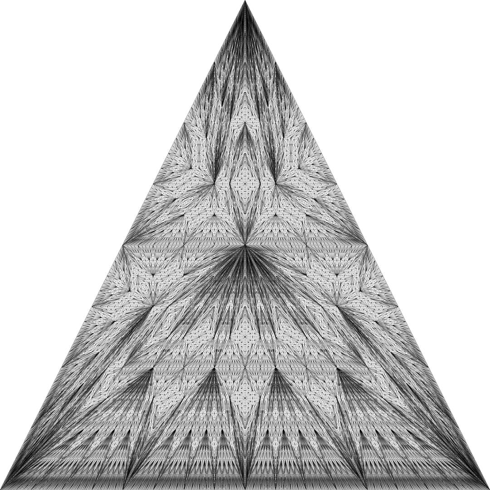

# Python Shapes

Small toolkit on top of Python Pillow (Imaging Library) to generate images and animations with Python.

One goal is to show how I create my artworks in Python (since I get that question more often than you think).
Another goal is to provide a few tools to get other people started with generating images and animations from Python code.

## Features
* Define image and video formats once in the settings. No need to pass those values as parameters in other places.
* `new_image()` and `save_image()` methods for image creation and saving. File names will always be unique and alphabetically and chronologically ordered. This is done by prepending them with a timestamp string. 
* `make_video()` method will turn a list of images into a movie, and put the movie and the still images in its own (unique) directory. (ffmpeg has to be installed, see below) 
* `Colors` object holds all the default colors (like `Colors.red`). This is the place to store your specific colors and reuse them.
* `get_random_color()` and `get_gradation_between_two_colors()` can turn every artwork into something colorful by adding one line of code.


## Installation
Only tested with Python 3.7.3 (but probably works with any Python 3 version) on Ubuntu 18.04

Get the code from GitHub:
```
git clone https://github.com/josvromans/python_shapes.git
```

Navigate to the python_shapes folder and create a virtual environment and install the requirements.
```
cd python_shapes/
virtualenv env (or virtualenv -p /usr/bin/python3.7 env)
. env/bin/activate
pip install -r requirements.txt
```

If you also want to make a video from a series of images, make sure ffmpeg is on your system:

    sudo apt-get install ffmpeg


## Create a shape
Open your terminal, navigate to the 'python_shapes' directory and create the virtual environment as described before (if you haven't done this already).

Run the following command to generate image(s):
```
python draw.py
```
By default it will draw a basic Triangle Subdivision. You should get exactly this image, generated in the /files folder:

If you don't want to draw this, you have to go to `/shapes/triangle_subdivision.py` and uncomment `line 72`.

Other examples are in `/shapes/example.py`. You can make two example movies by uncommenting the function calls in this file, and then run the draw command again:
```
python draw.py
```    
I designed this to always run the same command from the command line, and only change actual code to say what I want to draw.
If you create a custom method to draw something, I recommend to add a new file `your_new_artwork.py` where you will call a function that will draw it. And then import that one in `draw.py`.


## Create an animation
Animations can be made from a series of images. There is a method called `make_movie` and if you call that, it will make a mp4 file with 30 frames per second from all the .jpeg images in your files directory.
So before calling this method, you want to be sure that the image folder only contains the correct .jpeg files (so if you have a lot of other images generated, you should organize them by putting them in a sub directory). When you call this method right after image generation, you can make the still images plus the movie in one call.

For an example, look at the `make_movie_shrinking_trapezoid` method in `shapes/core/example.py`. If you uncomment this function call and execute 
`python draw.py` in your terminal, a series of images will be generated that will be turned into a mp4 movie straight away.

All formats are defined in `settings.py`. So for example, you can use .mov instead of .mp4 and .png instead of .jpeg.

## Pillow documentation
In this project I only show how to draw a line and a point (with Pillow's `draw.line` and `draw.point` methods). If you want to see all other options, please have a look at the Pillow documentation.
You can do all kind of things of course, like drawing polygons and ellipses, and fill with a color if you want.

If you want to use a different image file format than 'jpeg', here are the supported options:
https://pillow.readthedocs.io/en/stable/handbook/image-file-formats.html

## Concluding notes
If you are looking for an 'easy' way to generate fancy graphics (maybe 3d graphics), than this is the wrong project (and I cannot help you).
This is a lightweight image generation project, where you will have to do a lot of coding yourself to get high quality fancy graphics.

However, this project could be your playground to make images while playing with code / algorithms in Python. 
It could even be a starting point to learn coding in Python by generating images.

This project is based on my personal (not open-sourced) repository where I generated a lot of different artworks. I stripped out almost everything, so only the essential methods to generate an image and animation are left.
I am not planning to extend this project, because I really want to keep it as small as possible and hopefully the least confusing as possible for newbies in Python.

For example, I left out things like exception handling, and useful things like setting up different image formats in the settings (including different compression methods). These and many other things are left out intentially to keep this lightweight.

I hope it is of any use for you and I hope to illustrate the use of this project in a YouTube video soon.

## Artworks
You can look at artworks I made with Python on my website, Instagram and YouYube:
* www.josvromans.com
* www.instagram.com/jos.vromans
* https://www.youtube.com/channel/UChxcImh6byUqOdZUrjpAjsA
